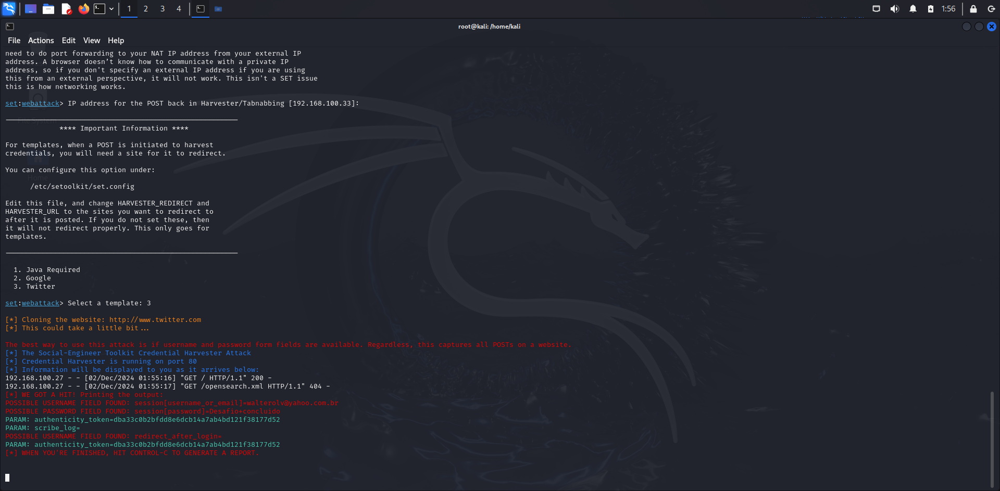

## Phishing para captura de senhas do Facebook

### Ferramentas

- Kali Linux
- setoolkit

### Configurando o Phishing no Kali Linux

- Acesso root: ``` sudo su ```
- Iniciando o setoolkit: ``` setoolkit ```
- Tipo de ataque: ``` Social-Engineering Attacks ```
- Vetor de ataque: ``` Web Site Attack Vectors ```
- Método de ataque: ```Credential Harvester Attack Method ```
- Método de ataque: ``` Site Cloner ```
- Obtendo o endereço da máquina: ``` ifconfig ```
- URL para clone: http://www.facebook.com

### Observação

###Observação:
- Não foi possivel resolver o desafio conforme explicado na aula. Melhor explicado no link abaixo.
https://github.com/RLLKLLSS/cibersecurity-desafio-phishing


### Resutados


Utilizei a opção: 1) Web Templates   3.Twitter


